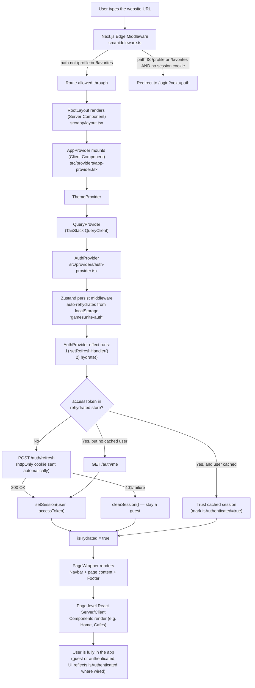
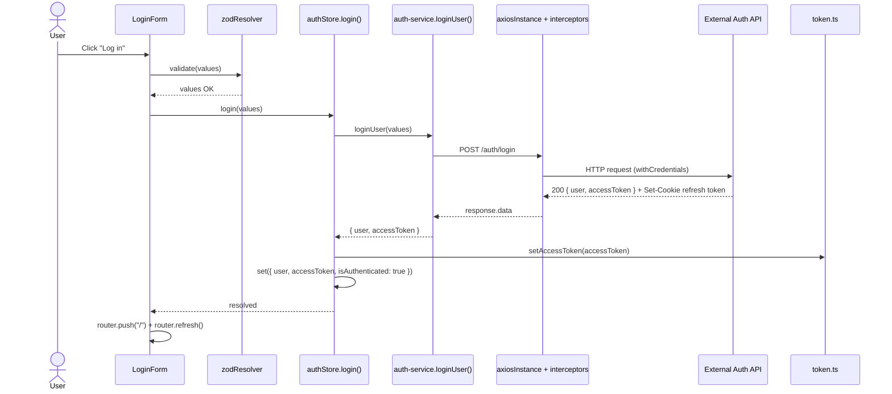
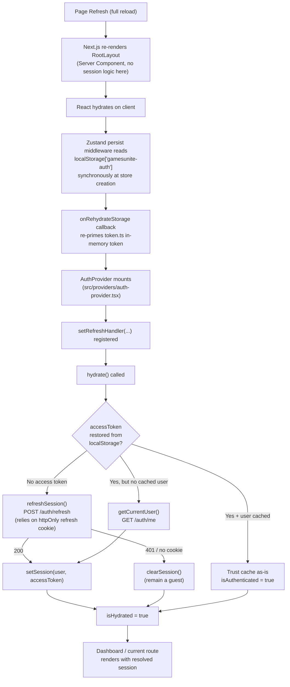
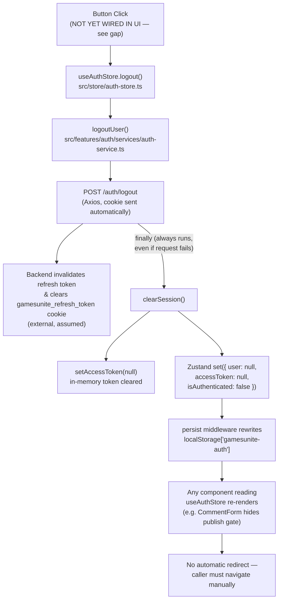
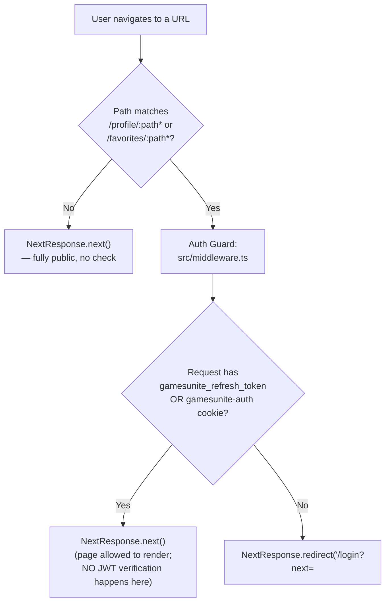
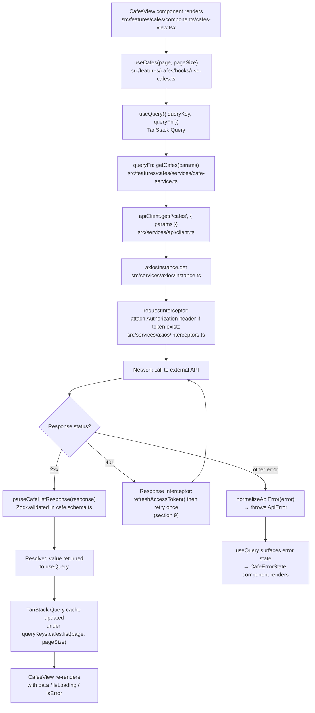
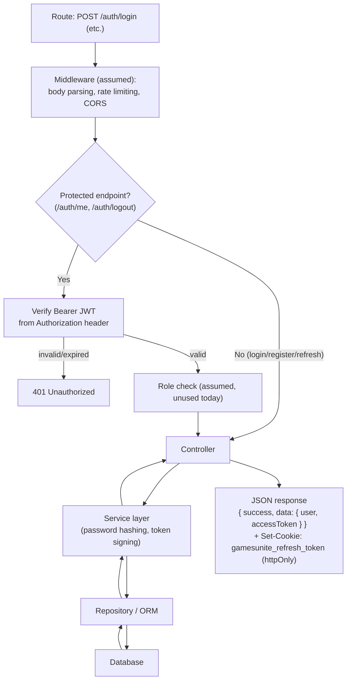
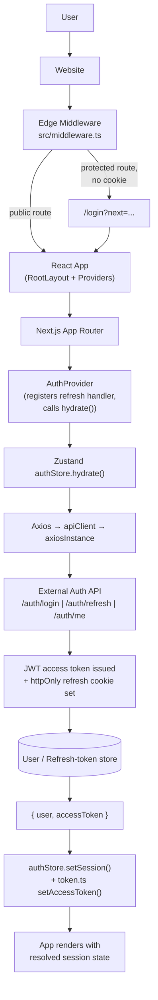
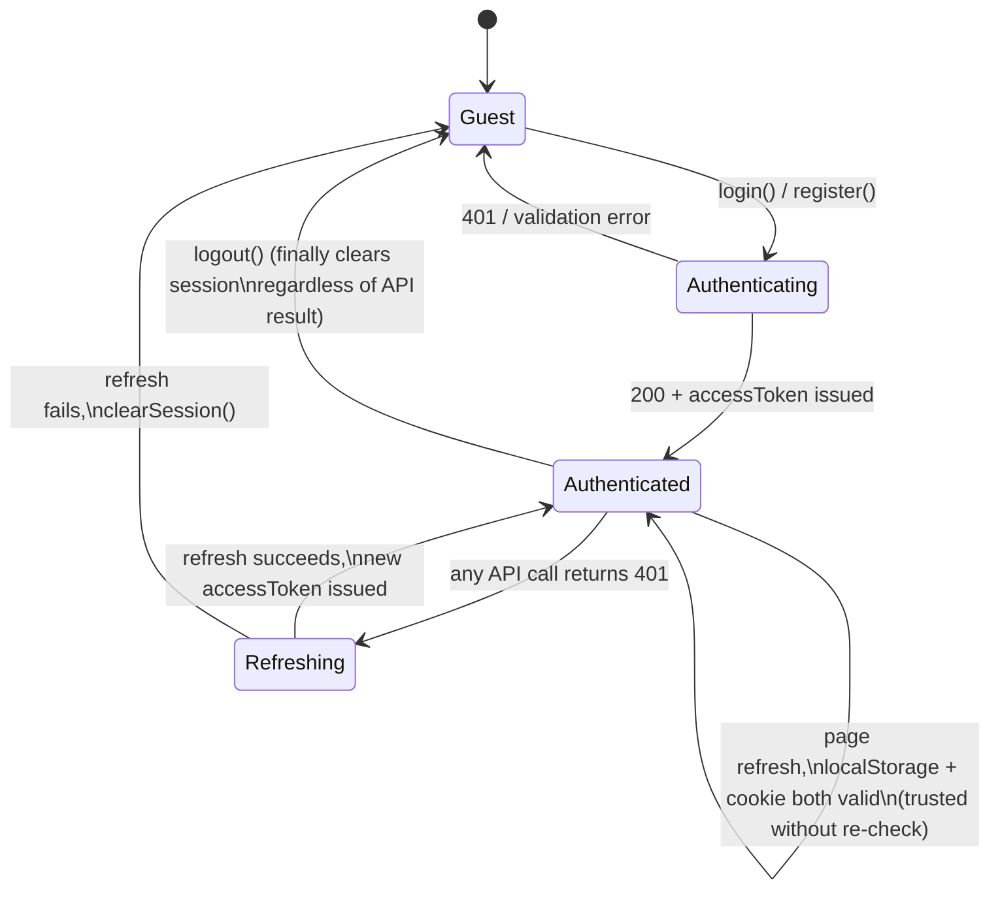

# GameHub / Gamers Unite — Authentication Flow

> Audience: a new senior engineer joining the team.
> Scope: this document describes the **actual, current implementation** found in this repository — not an idealized design. Every gap between "how it should work" and "how it currently works" is called out explicitly in section 14 (Known Gaps).

---

## 0. Scope & Important Context

This repository (`gamers-unite`) is a **Next.js 16 App Router frontend only**. There is no backend code in this repo (no controllers, no repositories, no database access, no server actions that touch a DB). The frontend talks to an **external REST API** over HTTP via Axios, configured through `NEXT_PUBLIC_API_BASE_URL` (`src/config/env.ts`).

This means:

- Everything under "Backend Authentication Flow" (section 11) describes the **HTTP contract the frontend assumes/consumes**, not code that lives in this repo. It is written from what the frontend sends and expects back (`src/features/auth/services/auth-service.ts`, `src/features/auth/types/api.ts`).
- There are **no** `middleware`/`controller`/`service`/`repository` backend layers to trace inside this codebase — the only "middleware" that exists is the **Next.js Edge Middleware** at `src/middleware.ts`, which is a route guard, not an authentication verifier.

Also important: some UI copy is stale. The `/login` and `/register` pages' `metadata.description` say "does not call a backend" / "local validation" (leftover from an earlier mock-only phase), but the actual `LoginForm`/`RegisterForm` components **do** call the real API through `auth-service.ts`. This is flagged again in section 14 — don't trust the page copy, trust the code.

---

## 1. High-Level Overview

### Authentication strategy
**JWT access token + refresh token**, issued by an external API:

- **Access token**: a short-lived JWT returned in the JSON response body of `/auth/login`, `/auth/register`, and `/auth/refresh`. Held in **client memory** (`src/services/axios/token.ts`) and mirrored into a **Zustand-persisted `localStorage` blob** (`src/store/auth-store.ts`) so it survives full page reloads.
- **Refresh token**: never touches JavaScript. It is expected to be set by the backend as an **httpOnly cookie** (`gamesunite_refresh_token`). The Axios instance is configured with `withCredentials: true` (`src/services/axios/instance.ts`) so this cookie is sent automatically on every request to the API origin.

### Authorization strategy
- `AuthUser.role: "user" | "creator" | "admin"` exists on the user type (`src/features/auth/types/auth.ts` → `src/features/auth/types/api.ts`).
- **No code in this repo currently reads or branches on `role`.** There is no role guard, no `<RequireRole>` component, no server-side role check. RBAC is a modeled-but-unimplemented extension point today (see section 14).

### Session management
- Client state lives in a Zustand store: `useAuthStore` (`src/store/auth-store.ts`), wrapped in the `persist` middleware.
- Persisted slice: `{ user, accessToken, isAuthenticated }` under `localStorage` key `"gamesunite-auth"`.
- `isHydrated` is tracked but **not currently consumed** by any component to gate rendering (a `useAuthStore.getState().isHydrated` check exists in the store shape only).

### Token flow (short version)
1. Login/Register/Refresh → backend returns `{ user, accessToken }` in the JSON body.
2. `setAccessToken()` stores the JWT in an in-memory module variable (for synchronous read by the Axios request interceptor).
3. Zustand `persist` mirrors `{ user, accessToken, isAuthenticated }` to `localStorage`.
4. Every outgoing request attaches `Authorization: Bearer <accessToken>` if a token is present.

### Refresh token flow (short version)
1. Any API call gets a `401`.
2. The Axios response interceptor (`src/services/axios/interceptors.ts`) intercepts it, checks it's not already a retry and not the `/auth/refresh` or `/auth/login` calls themselves (loop guard).
3. It calls a shared, de-duplicated `refreshAccessToken()` (`src/services/axios/token.ts`), which delegates to a handler injected by `AuthProvider` (`src/providers/auth-provider.tsx`).
4. That handler calls `POST /auth/refresh` (cookie sent automatically), gets a new `{ user, accessToken }`, updates the store, and returns the new token so the original request is retried once.

### Role-based access
Modeled, not enforced (see Authorization strategy above).

### Protected routes
`/profile/:path*` and `/favorites/:path*`, enforced only in `src/middleware.ts` via **cookie presence**, not JWT verification. **Note:** neither `/profile` nor `/favorites` has an actual page yet — only `src/features/profile/.gitkeep` and `src/features/favorites/.gitkeep` placeholders exist. The guard is forward-looking infrastructure for features not yet built.

### Public routes
`/`, `/cafes`, `/games`, `/reviews`, `/search`, `/membership` — no auth check at all, server or client.

### Guest routes
`/login`, `/register`, `/forgot-password`, `/reset-password`, `/otp-verification` — also unguarded. There is **no** redirect-away-if-already-authenticated logic on these pages (a logged-in user can freely revisit `/login`).

---

## 2. End-to-End User Journey

Narrated, step by step:

1. **User types the URL** and hits Enter. The request first reaches Next.js's Edge Middleware, before any React code runs.
2. **`src/middleware.ts`** checks `request.nextUrl.pathname` against `config.matcher: ["/profile/:path*", "/favorites/:path*"]`. For any other path (which is almost the entire app today), it immediately calls `NextResponse.next()` — no auth check happens for public/guest routes at all.
3. If the path *is* protected, it checks for the `gamesunite_refresh_token` cookie (or a `gamesunite-auth` cookie — see the bug noted in section 14) using `request.cookies.has/get`. If missing, it 302-redirects to `/login?next=<original path>`.
4. Assuming the route is allowed, Next.js renders **`src/app/layout.tsx`** (`RootLayout`, a Server Component). It sets global fonts, JSON-LD SEO tags, and wraps everything in `<AppProvider>` → `<PageWrapper>`.
5. **`AppProvider`** (`src/providers/app-provider.tsx`, `"use client"`) is the client boundary. It nests `ThemeProvider` → `QueryProvider` → `AuthProvider`, in that order (theme doesn't depend on auth; the query cache is created before auth so auth-aware queries can use it immediately).
6. Before React even paints, Zustand's `persist` middleware synchronously reads `localStorage["gamesunite-auth"]` (if present) during store creation and calls `onRehydrateStorage`, which re-primes the in-memory access token module (`setAccessToken`) in `src/services/axios/token.ts`.
7. **`AuthProvider`** mounts and its `useEffect` runs exactly once: it registers a refresh callback via `setRefreshHandler()` (dependency-injecting the React/Zustand world into the framework-agnostic Axios `token.ts` module, avoiding a circular import), then calls `hydrate()`.
8. `useAuthStore.hydrate()` (`src/store/auth-store.ts`) branches on what was in `localStorage`:
   - No `accessToken` → call `refreshSession()` (`POST /auth/refresh`), relying purely on the httpOnly cookie. Success sets a fresh session; failure clears it (silently — the user is treated as a guest).
   - `accessToken` present but no cached `user` → call `getCurrentUser()` (`GET /auth/me`) to repopulate the profile.
   - Both present → trust the cached session as-is (no server round-trip; a stale/expired token is only discovered on the next real API call, via the 401→refresh interceptor).
   - In every branch, `isHydrated` is finally set to `true`.
9. **`PageWrapper`** (`src/components/layout/page-wrapper.tsx`) renders the `Navbar`, the routed page content (`<main>`), and the `Footer`.
10. The requested page (Server or Client Component) renders. If it's an authenticated area or an auth-sensitive UI (currently only `CommentForm` reads `isAuthenticated`), it reflects the session state resolved in step 8.
11. The user is now "in the app" — authenticated or guest — and can navigate, submit forms, and trigger further API calls that reuse this same token/refresh pipeline.

---

## 3. File-by-File Execution Order

This is the literal module/import chain from URL entry to a rendered page, in the order each file is invoked.

**1. `src/middleware.ts`**
Purpose: Edge-level route guard. Runs on the Edge runtime before any page code, for every request matched by `config.matcher`.
Calls: `NextResponse.next()` or `NextResponse.redirect()`.
Next File: ↓ Next.js internal routing → `src/app/layout.tsx`

**2. `src/app/layout.tsx`** (`RootLayout`, Server Component)
Purpose: Global HTML shell, fonts (Geist), SEO metadata (`createMetadata`, `JsonLd`), and mounts the provider tree.
Calls: `<AppProvider>` wrapping `<PageWrapper>`.
Next File: ↓ `src/providers/index.ts` → `src/providers/app-provider.tsx`

**3. `src/providers/app-provider.tsx`** (`"use client"`)
Purpose: Composition root for all client-side cross-cutting providers, in dependency order (theme → query cache → auth).
Calls: `ThemeProvider` → `QueryProvider` → `AuthProvider`.
Next File: ↓ `src/providers/theme-provider.tsx`, `src/providers/query-provider.tsx`, `src/providers/auth-provider.tsx`

**4. `src/providers/theme-provider.tsx`**
Purpose: Wraps `next-themes` for dark/light mode. Unrelated to auth but sits outermost since it has no dependency on session state.
Next File: ↓ `src/providers/query-provider.tsx`

**5. `src/providers/query-provider.tsx`** (`"use client"`)
Purpose: Creates one `QueryClient` per browser session (via `React.useState(makeQueryClient)`) and provides it via `QueryClientProvider`. Configures `staleTime: 60_000`, `refetchOnWindowFocus: false`, `retry: 1`.
Calls: `AuthProvider` (children).
Next File: ↓ `src/providers/auth-provider.tsx`

**6. `src/providers/auth-provider.tsx`** (`"use client"`)
Purpose: Wires the framework-agnostic Axios token module to the Zustand store, and kicks off session restoration.
Calls: `setRefreshHandler()` (`src/services/axios/token.ts`), `refreshSession()` (`src/features/auth/services/auth-service.ts`), `useAuthStore.hydrate()` / `.setSession()` / `.clearSession()` (`src/store/auth-store.ts`).
Next File: ↓ `src/store/auth-store.ts`

**7. `src/store/auth-store.ts`**
Purpose: Zustand store — single source of truth for `user`, `accessToken`, `isAuthenticated`, `isHydrated`, and the auth actions (`login`, `register`, `logout`, `hydrate`, `setSession`, `clearSession`). Persisted to `localStorage` via `persist` middleware (key `gamesunite-auth`).
Calls: `src/features/auth/services/auth-service.ts` (all network calls), `src/services/axios/token.ts` (`setAccessToken`).
Next File: ↓ `src/features/auth/services/auth-service.ts`

**8. `src/features/auth/services/auth-service.ts`**
Purpose: Feature-level API service — the only place that knows the `/auth/*` endpoint shapes. Pure functions, no React.
Calls: `src/services/api/client.ts` (`apiClient.get/post`).
Next File: ↓ `src/services/api/client.ts`

**9. `src/services/api/client.ts`**
Purpose: Thin, typed wrapper over the shared Axios instance (`get/post/put/patch/delete`), normalizing request config (headers, params, abort signal) and unwrapping `response.data`.
Calls: `src/services/axios/instance.ts` (`axiosInstance`).
Next File: ↓ `src/services/axios/instance.ts`

**10. `src/services/axios/instance.ts`**
Purpose: Creates the single shared `axios.create()` instance — `baseURL` from `env.apiBaseUrl`, `timeout` from `env.apiTimeout`, `withCredentials: true` (so the httpOnly refresh cookie is always sent), JSON content-type default.
Calls: `applyInterceptors()` (`src/services/axios/interceptors.ts`).
Next File: ↓ `src/services/axios/interceptors.ts`

**11. `src/services/axios/interceptors.ts`**
Purpose: (a) Request interceptor — reads the in-memory token and sets `Authorization: Bearer <token>`. (b) Response interceptor — on `401`, deduplicates and triggers a token refresh, then retries the original request once.
Calls: `src/services/axios/token.ts` (`getAccessToken`, `refreshAccessToken`, `setAccessToken`), `src/services/axios/error.ts` (`normalizeApiError`).
Next File: ↓ `src/services/axios/token.ts`, `src/services/axios/error.ts`

**12. `src/services/axios/token.ts`**
Purpose: Framework-agnostic module holding the **in-memory access token** and the **injected refresh handler**, plus a mutex (`refreshPromise`) so concurrent 401s trigger only one refresh call.
Next File: (leaf module — called by both `interceptors.ts` and `auth-provider.tsx`)

**13. `src/services/axios/error.ts`**
Purpose: Normalizes any thrown error (Axios error, native error, or unknown) into a single `ApiError` class with `message`, `code`, `errors` (field-level validation map), and `statusCode`.
Next File: (leaf module — consumed by every form's `catch` block)

**14. `src/components/layout/page-wrapper.tsx`**
Purpose: Shared page chrome — renders `Navbar`, the routed `children`, and `Footer`, plus an optional `Sidebar`.
Calls: `src/components/navigation/navbar.tsx`, `src/components/layout/footer.tsx`.
Next File: ↓ the routed page under `src/app/**/page.tsx`

**15. Routed page** (e.g. `src/app/login/page.tsx`, `src/app/page.tsx`, `src/app/cafes/page.tsx`, …)
Purpose: Route-specific Server Component that sets `metadata` and renders feature views/forms (often lazily via `src/lib/lazy/feature-views.tsx`).
Calls: Feature components under `src/features/**`.

This chain covers **every** provider, service, Axios layer, and utility involved before a single pixel of page-specific UI is shown. Feature-specific continuations (login, register, API data-fetching) are detailed in the sections below.

---

## 4. Login Flow

Trigger: user is on `/login` and clicks **"Log in"**.

| # | File | Function | Purpose | Next File |
|---|------|----------|---------|-----------|
| 1 | `src/app/login/page.tsx` | `LoginPage` | Renders `<AuthShell>` wrapping the lazily-loaded `LoginForm`. | `src/lib/lazy/feature-views.tsx` |
| 2 | `src/lib/lazy/feature-views.tsx` | `dynamic(() => import(...))` | Code-splits the login form into its own chunk (`next/dynamic`), showing `AuthFormSkeleton` while loading — reduces the initial `/login` bundle. | `src/features/auth/components/login-form.tsx` |
| 3 | `src/features/auth/components/login-form.tsx` | `LoginForm` (render) | Sets up `useForm<LoginFormValues>` with `zodResolver(loginSchema)` and default values `{ email: "", password: "", remember: false }`. | — (waits for submit) |
| 4 | `src/features/auth/components/login-form.tsx` | `handleSubmit(onSubmit)` (React Hook Form) | **Button clicked.** RHF runs the resolver before calling `onSubmit`. | `src/features/auth/components/zod-resolver.ts` |
| 5 | `src/features/auth/components/zod-resolver.ts` | `zodResolver(loginSchema)` | **Validation.** Runs `loginSchema.safeParse(values)` (`src/features/auth/schemas/auth.schema.ts`: valid email, non-empty password). On failure, returns field-keyed errors and `onSubmit` never runs; each `AuthField` shows its `role="alert"` message. | back to `login-form.tsx` `onSubmit` (on success) |
| 6 | `src/features/auth/components/login-form.tsx` | `onSubmit(values)` | Clears prior status/error state, then calls the store action. | `src/store/auth-store.ts` |
| 7 | `src/store/auth-store.ts` | `login(values)` | **API request kickoff.** Calls `loginUser(values)` and awaits the result. | `src/features/auth/services/auth-service.ts` |
| 8 | `src/features/auth/services/auth-service.ts` | `loginUser(values)` | Calls `apiClient.post<ApiEnvelope<AuthResponse>, LoginFormValues>("/auth/login", values)`. | `src/services/api/client.ts` |
| 9 | `src/services/api/client.ts` | `apiClient.post` | Builds request config (headers/params/signal) and calls `axiosInstance.post`. | `src/services/axios/instance.ts` → `interceptors.ts` |
| 10 | `src/services/axios/interceptors.ts` | `requestInterceptor` | Sets `Accept: application/json`, `withCredentials = true`, and `Authorization` header **only if** a token already exists (it won't on first login). | network |
| 11 | *(external backend)* | `POST /auth/login` | **Backend route → controller → service → database (external, not in this repo).** Verifies email exists, verifies password hash (e.g. bcrypt/argon2 compare), generates a new JWT access token and a refresh token, sets the refresh token as an **httpOnly, `Secure`, `SameSite` cookie** (`gamesunite_refresh_token`), and returns `{ success: true, data: { user, accessToken } }`. | back to `interceptors.ts` response side |
| 12 | `src/services/axios/interceptors.ts` | response interceptor (success path) | `2xx` response passes straight through unchanged. | `src/services/api/client.ts` |
| 13 | `src/services/api/client.ts` | `apiClient.post` (continued) | Returns `response.data` (the `ApiEnvelope<AuthResponse>`). | `src/features/auth/services/auth-service.ts` |
| 14 | `src/features/auth/services/auth-service.ts` | `loginUser` (continued) | Returns `response.data` (unwraps the envelope to `{ user, accessToken }`). | `src/store/auth-store.ts` |
| 15 | `src/store/auth-store.ts` | `login` (continued) → `get().setSession(user, accessToken)` | **Context/store update.** | `src/store/auth-store.ts` (`setSession`) |
| 16 | `src/store/auth-store.ts` | `setSession(user, accessToken)` | Calls `setAccessToken(accessToken)` (primes the in-memory token for the next Axios call), then `set({ user, accessToken, isAuthenticated: true })`. The `persist` middleware synchronously writes this slice to `localStorage["gamesunite-auth"]`. | `src/services/axios/token.ts` |
| 17 | `src/services/axios/token.ts` | `setAccessToken` | Updates the module-level `accessToken` variable used by the request interceptor. | back to `login-form.tsx` |
| 18 | `src/features/auth/components/login-form.tsx` | `onSubmit` (continued) | **React rerender**: Zustand's subscription causes any component reading `useAuthStore` (e.g. `CommentForm`) to re-render. Sets a local success `status` message, then **redirect**: `router.push("/")` followed by `router.refresh()` (forces Server Components on the target route to re-fetch, since RSC payloads can be session-dependent). | — |

If the API rejects the credentials (`401`) or fails validation server-side (`400`), the `catch` block in `onSubmit` receives an `ApiError` (thrown by `normalizeApiError` inside the response interceptor's rejection path) and renders `error.message` inline via `role="alert"`.

---

## 5. Registration Flow

Trigger: user is on `/register` and clicks **"Create account"**. Structurally identical to Login, with a different schema and endpoint.

| # | File | Function | Purpose | Next File |
|---|------|----------|---------|-----------|
| 1 | `src/app/register/page.tsx` | `RegisterPage` | Renders `<AuthShell>` + lazily-loaded `RegisterForm`. | `src/lib/lazy/feature-views.tsx` |
| 2 | `src/features/auth/components/register-form.tsx` | `RegisterForm` (render) | `useForm<RegisterFormValues>` with `zodResolver(registerSchema)`, defaults `{ name, email, password, confirmPassword, acceptTerms: false }`. | — |
| 3 | `src/features/auth/schemas/auth.schema.ts` | `registerSchema` | **Validation.** `name` ≥ 2 chars; `email` valid; `password` ≥ 8 chars + 1 uppercase + 1 number (`passwordSchema`); `confirmPassword` required; `acceptTerms` must be `true`; cross-field `.refine()` ensures `password === confirmPassword` (error attached to `confirmPassword`). | `register-form.tsx` `onSubmit` |
| 4 | `src/features/auth/components/register-form.tsx` | `onSubmit(values)` | Clears status/error, calls the store action. | `src/store/auth-store.ts` |
| 5 | `src/store/auth-store.ts` | `register(values)` | Calls `registerUser(values)`, awaits result. | `src/features/auth/services/auth-service.ts` |
| 6 | `src/features/auth/services/auth-service.ts` | `registerUser(values)` | Calls `apiClient.post("/auth/register", { name, email, password })` — **note:** `confirmPassword` and `acceptTerms` are intentionally stripped before the request (`Pick<RegisterFormValues, "name" \| "email" \| "password">`); they are client-only validation fields. | `src/services/api/client.ts` → Axios pipeline (identical to Login steps 9–13) |
| 7 | *(external backend)* | `POST /auth/register` | Creates the user record, hashes the password before storing, issues an access token + refresh token exactly like login, returns `{ user, accessToken }`. | back through Axios |
| 8 | `src/store/auth-store.ts` | `register` (continued) → `setSession(user, accessToken)` | Identical session-establishment path as Login step 16. | `src/services/axios/token.ts` |
| 9 | `src/features/auth/components/register-form.tsx` | `onSubmit` (continued) | Sets success status, `router.push("/")`, `router.refresh()`. | — |

**Key difference from login:** registration immediately authenticates the user (no separate "verify email" gate is enforced in this flow — see OTP note below).

### 5.1 Password Reset Flow (Forgot Password → Reset Password)

This is a two-page, two-request flow that is **independent of the session** (it never touches `useAuthStore`):

1. **`src/app/forgot-password/page.tsx`** → `ForgotPasswordForm` (`src/features/auth/components/forgot-password-form.tsx`).
   `onSubmit` validates via `forgotPasswordSchema` (email only), then calls `requestPasswordReset(values)` (`auth-service.ts`) → `POST /auth/forgot-password`. The backend is expected to email a reset link containing a token; the frontend just shows the returned `message` (e.g. "check your email").
2. **`src/app/reset-password/page.tsx`** → `ResetPasswordForm` (`src/features/auth/components/reset-password-form.tsx`), wrapped in `<Suspense>` because it reads `useSearchParams()` (required by Next.js for `useSearchParams` in a page tree).
   Reads `token` from the URL query string. Validates the new password via `resetPasswordSchema` (same complexity rule as registration, plus `confirmPassword` match). Calls `resetPassword(values, token)` → `POST /auth/reset-password { password, token }`. On success, `router.push("/login")` — the user must log in again with the new password (no auto-login here).

### 5.2 OTP Verification (Currently Mocked)

**`src/app/otp-verification/page.tsx`** → `OtpVerificationForm` (`src/features/auth/components/otp-verification-form.tsx`) validates a 6-digit code via `otpSchema`, but `onSubmit` **only sets a local status message** (`"Mock code ${values.code} verified."`) — it never calls `auth-service.ts` or any endpoint, and no other flow (login/register) navigates a user to this page. It is an isolated, non-wired screen today. Treat it as scaffolding for a future MFA/email-verification step, not a live security control.

---

## 6. Session Restore Flow (Page Refresh)

Narrated:

1. **Page refresh** — the browser does a full reload, so all in-memory JS state (the `token.ts` module variable, React state) is wiped. Only `localStorage` and cookies survive.
2. **React re-mounts** the whole provider tree from scratch, same as the very first visit (section 2).
3. Zustand's `persist` middleware reads `localStorage["gamesunite-auth"]` **synchronously during store initialization** (before `AuthProvider`'s effect runs) and calls `onRehydrateStorage(...)`, which re-primes `token.ts`'s in-memory `accessToken` if one was persisted.
4. **`AuthProvider`**'s `useEffect` fires once: registers the refresh handler, then calls `hydrate()`.
5. **`hydrate()`** (`src/store/auth-store.ts`) is the actual decision point:
   - **No access token in cookies?** → there is no such cookie check here; this is purely about what was in `localStorage`. If `accessToken` is falsy, it assumes the session must be re-established from the **refresh token cookie** by calling `refreshSession()`. This is the correct behavior for e.g. a fresh browser profile with only the httpOnly cookie surviving (localStorage cleared but cookie intact), or for the very first hydration after `persist` finishes.
   - **Access token present, no user** → fetches `/auth/me` to repopulate the profile without a full refresh round-trip.
   - **Both present** → trusts `localStorage` outright. This is an optimistic trust decision: an expired-but-present token will only be caught the next time a real API call 401s (see section 9 for the security trade-off).
6. Regardless of branch outcome, `isHydrated` is set to `true` at the end. **No component currently reads this flag**, so there is no "auth-aware loading spinner" gating the UI during hydration — pages render immediately with whatever `isAuthenticated` value was available at that render tick (a minor flash-of-wrong-state risk on slow refresh calls; see section 14).
7. The current route renders with the resolved session.

---

## 7. Logout Flow

Narrated:

1. **`useAuthStore.logout()`** (`src/store/auth-store.ts`) calls `logoutUser()` (`auth-service.ts`), which does `POST /auth/logout` through the standard Axios pipeline (Authorization header attached if a token is still present).
2. The backend is expected to invalidate the refresh token server-side and clear the `gamesunite_refresh_token` cookie in its response.
3. **Regardless of success or failure** of that network call, the `finally` block runs `get().clearSession()` — this guarantees the client always forgets its local session even if the network is down or the server errors, which is the correct fail-safe direction for a logout action.
4. `clearSession()` nulls the in-memory token (`setAccessToken(null)`), resets `user`/`accessToken`/`isAuthenticated` in the store, and `persist` immediately rewrites `localStorage`.
5. Any subscribed component re-renders (e.g. `CommentForm` would revert to "Log in to publish a review").
6. **There is no redirect step** inside `logout()` itself — a caller is expected to `router.push("/login")` or similar after calling it.

**Gap:** as of this writing, `logout` is defined on the store but **no UI component calls it** — there is no logout button in `Navbar` or anywhere else. See section 14.

---

## 8. Route Protection Flow

Files involved:

- **`src/middleware.ts`** — the *only* route-protection mechanism in this codebase. It is Edge middleware, so it runs before any Server or Client Component. `config.matcher = ["/profile/:path*", "/favorites/:path*"]` scopes it to just those two prefixes; every other route bypasses this file's logic entirely (`requiresAuth` is `false`, immediate `NextResponse.next()`).
- The check itself, `request.cookies.has("gamesunite_refresh_token") || Boolean(request.cookies.get("gamesunite-auth"))`, is a **presence check only** — it does not decode, verify, or even read the JWT. A stale or already-expired refresh token cookie would still pass this gate; actual validity is only proven when the page later calls the API and gets a `401`.
- If the cookie is missing, it redirects to `/login` with a `?next=<originalPath>` query param so the user can be sent back after logging in — **but no page currently reads `next`** (`LoginForm.onSubmit` always does `router.push("/")` — see section 14).
- There is **no client-side route guard** (no `<ProtectedRoute>` wrapper, no `useRequireAuth` hook). The only client-side auth gate in the app is the ad-hoc `isAuthenticated` check inside `CommentForm` (`src/features/reviews/components/comment-form.tsx`), which disables a *feature* (submitting a review), not a *route*.
- Because `/profile` and `/favorites` have no `page.tsx` yet, hitting those paths today would 404 (via `src/app/not-found.tsx`) regardless of auth state, after passing (or failing) the middleware check.

---

## 9. Token Lifecycle

| Stage | Detail |
|---|---|
| **Access token creation** | Backend mints a JWT on `POST /auth/login`, `POST /auth/register`, or `POST /auth/refresh`. Returned in the **JSON response body** as `accessToken` (never as a cookie). |
| **Storage** | Two places, kept in sync: (1) an in-memory `let accessToken` in `src/services/axios/token.ts` — read synchronously by the Axios request interceptor on every call; (2) the Zustand `persist` slice in `localStorage["gamesunite-auth"]` — survives full page reloads. **This is `localStorage`, not an httpOnly cookie**, so it is readable by any JS running on the page (see the XSS trade-off in section 14). |
| **Usage** | `requestInterceptor` (`src/services/axios/interceptors.ts`) sets `Authorization: Bearer <token>` on every outgoing request when `getAccessToken()` returns a value. |
| **Expiry** | Not enforced client-side — the app does not decode the JWT `exp` claim proactively. Expiry is discovered reactively: the API returns `401`, which triggers the refresh interceptor. |
| **Refresh** | On `401` (and only if the failing request is not itself `/auth/refresh` or `/auth/login`, and hasn't already been retried once — the `_retry` flag guards against infinite loops), `refreshAccessToken()` (`token.ts`) is invoked. It de-duplicates concurrent refresh attempts via a single shared `refreshPromise` (mutex pattern) — if five requests 401 at once, only one `POST /auth/refresh` fires. |
| **Replacement** | The refresh handler (registered by `AuthProvider`) calls `refreshSession()` → `POST /auth/refresh` (refresh cookie sent automatically via `withCredentials: true`) → on success, `setSession(user, accessToken)` updates both storage locations, and the original failed request is retried once with the new `Authorization` header. |
| **Logout / invalidation** | `clearSession()` nulls the in-memory token and the persisted store slice. The refresh token itself is expected to be invalidated and its cookie cleared **server-side** in response to `POST /auth/logout` — the frontend has no ability to delete an httpOnly cookie directly, by design. |
| **Refresh-token storage & security** | httpOnly cookie (`gamesunite_refresh_token`), inaccessible to JavaScript — correct practice, protects it from XSS theft. `withCredentials: true` + presumed `SameSite`/`Secure` attributes (set by the backend, not visible in this repo) protect it from CSRF and transport-layer leakage. |
| **Access-token security trade-off** | Stored in `localStorage`, which is vulnerable to exfiltration via any successful XSS injection (unlike an httpOnly cookie). This is a common, accepted trade-off for SPA access tokens *if* the token is short-lived and CSP is strict — but there is no visible CSP configuration in this repo to confirm that mitigation is in place. Flagged in section 14. |

---

## 10. API Request Flow

Since there is no dedicated "dashboard" page in this app yet, the clearest real example of the shared request pipeline is the **Cafes** feature, which already uses TanStack Query end-to-end and exercises the exact same Axios/interceptor path that authenticated calls use.

Step-by-step:

1. **`CafesView`** (`src/features/cafes/components/cafes-view.tsx`) calls the **`useCafes`** hook.
2. **`useCafes`** (`src/features/cafes/hooks/use-cafes.ts`) wraps TanStack Query's `useQuery`, keyed by `queryKeys.cafes.list(page, pageSize)` (`src/services/query/keys.ts`), with `queryFn: () => getCafes({ page, pageSize })`.
3. **`getCafes`** (`src/features/cafes/services/cafe-service.ts`) calls `apiClient.get<CafeListResponse>("/cafes", { params })` — this is the **service layer**; components never call Axios directly (enforced by convention across the codebase — confirmed no component imports `axiosInstance` directly).
4. **`apiClient.get`** (`src/services/api/client.ts`) merges request options and delegates to `axiosInstance.get`.
5. **`requestInterceptor`** (`src/services/axios/interceptors.ts`) attaches `Authorization: Bearer <token>` **only if** `getAccessToken()` returns a value — for a logged-out user this header is simply omitted, and public endpoints like `/cafes` don't require it.
6. The request goes out to the external backend.
7. On success, `cafe-service.ts` validates the payload shape at runtime with Zod (`parseCafeListResponse`, `src/features/cafes/schemas/cafe.schema.ts`) before returning it — this guards the frontend against a backend contract drift crashing the UI with an unhandled shape error.
8. On a `401`, the exact same refresh-and-retry mechanism from section 9 kicks in transparently — `useCafes` doesn't know or care that a refresh happened.
9. On any other error, `normalizeApiError` throws an `ApiError`, which TanStack Query surfaces as `query.error`, and the calling view renders `CafeErrorState` (`src/features/cafes/components/cafe-error-state.tsx`).
10. On success, TanStack Query caches the result under its query key (`staleTime: 60s` globally, from `query-provider.tsx`) and the component re-renders with `data`.

This is the same pipeline every authenticated mutation (e.g. `CommentForm`'s `createReview`) and every auth call (login/register/refresh) travels through — the only feature-specific pieces are the service function and the Zod schema; the transport, auth-header attachment, and refresh logic are fully shared.

---

## 11. Backend Authentication Flow *(external system — inferred from the frontend contract, not code in this repo)*

No backend source exists in this repository. This section documents the **HTTP contract** the frontend has been built against, inferred entirely from `src/features/auth/services/auth-service.ts` and `src/features/auth/types/api.ts`. Treat this as an integration contract to confirm against the real backend team/repo, not as verified backend implementation detail.

Contract surface consumed by this frontend (`src/features/auth/services/auth-service.ts`):

| Endpoint | Method | Request body | Expected response | Frontend caller |
|---|---|---|---|---|
| `/auth/register` | POST | `{ name, email, password }` | `{ success, data: { user, accessToken } }` | `registerUser` |
| `/auth/login` | POST | `{ email, password, remember }` | `{ success, data: { user, accessToken } }` | `loginUser` |
| `/auth/logout` | POST | *(none)* | `{ message }` | `logoutUser` |
| `/auth/refresh` | POST | *(none — uses refresh cookie)* | `{ success, data: { user, accessToken } }` | `refreshSession` |
| `/auth/me` | GET | *(none — uses Bearer token)* | `{ success, data: { user } }` | `getCurrentUser` |
| `/auth/forgot-password` | POST | `{ email }` | `{ success, data: { message } }` | `requestPasswordReset` |
| `/auth/reset-password` | POST | `{ password, token }` | `{ success, data: { message } }` | `resetPassword` |

Implied backend responsibilities (standard for this contract, not verifiable in-repo):
- **Password verification**: compare submitted password against a stored hash (bcrypt/argon2) — never plaintext.
- **JWT generation**: short-lived access token signed with a server-side secret, embedding at minimum `sub` (user id) and likely `role`.
- **Refresh token generation**: longer-lived, stored server-side (DB or cache) or as a signed opaque token, delivered only via `Set-Cookie` with `HttpOnly; Secure; SameSite=Lax|Strict`.
- **Database**: user table/collection for credentials + profile, likely a refresh-token table for revocation/rotation.

---

## 12. Error Flow

All errors that can reach a user-facing form or query ultimately pass through **`normalizeApiError`** (`src/services/axios/error.ts`), which converts anything thrown into an `ApiError { message, code?, errors?, statusCode? }`.

| Scenario | What happens on the frontend | What's assumed on the backend |
|---|---|---|
| **Invalid password** (login) | Backend returns `401` (or `400` with a generic message to avoid user enumeration) → `normalizeApiError` builds an `ApiError` from `response.data.message` → `LoginForm`'s `catch` sets `errorMessage`, rendered via `role="alert"`. Because the failing request's URL includes `/auth/login`, the refresh-retry logic in the interceptor is explicitly **skipped** (see the `!originalRequest.url?.includes("/auth/login")` guard) — a bad login attempt never triggers a refresh loop. | Rejects with `401`, does not reveal whether the email or the password was wrong. |
| **Expired access token** (any authenticated call) | First response is `401`. Interceptor checks `!originalRequest._retry` (true) and the URL isn't `/auth/refresh`/`/auth/login` → calls `refreshAccessToken()` → on success, retries the original call once with the new token, transparently to the caller. If refresh also fails, the **original 401 `ApiError` propagates** to the caller (e.g. `useQuery`'s `error`, or a form's `catch`), and `AuthProvider`'s injected handler has already called `clearSession()` in that failure path. | `/auth/refresh` validates the refresh cookie; if also expired/invalid, returns `401`. |
| **Invalid/tampered token** | Same path as "expired" — the backend can't distinguish "expired" from "invalid" from the frontend's point of view; both surface as `401` and go through the same refresh-then-fail path. | Signature/claims validation fails → `401`. |
| **Network failure** (no connectivity, timeout, DNS) | `axios.isAxiosError(error)` is true but `error.response` is `undefined` → `normalizeApiError` falls through to the final branch: `new ApiError({ message: axiosError.message || DEFAULT_ERROR_MESSAGE, statusCode: undefined })`. Forms show a generic "Unable to log in right now." / "Unable to create your account right now." fallback (since `error instanceof ApiError` is still true, but `error.message` is often a low-level Axios/browser message, so most forms prefer their own fallback copy over `error.message` in the network-failure case — check each form's ternary). | N/A |
| **401** (generic, non-refresh-eligible, e.g. hitting `/auth/refresh` itself with an invalid cookie) | Propagates directly as an `ApiError` with `statusCode: 401` — no further retry is attempted (the interceptor explicitly excludes `/auth/refresh` from the retry-trigger condition to avoid an infinite refresh loop). `AuthProvider`'s refresh handler catches this and calls `clearSession()`. | Returns `401`, likely also clears the refresh cookie via `Set-Cookie` with `Max-Age=0`. |
| **403** (authorization / role failure) | No code path in the frontend specifically distinguishes `403` today — it would still be normalized into a generic `ApiError` and shown as `error.message` wherever the calling code has a `catch`. There is **no** role-based UI (e.g. "You don't have permission") because RBAC isn't implemented client-side (section 1/14). | Would be returned if a role check inside a protected endpoint fails. |
| **500 / unexpected server error** | `responseData` may or may not match `ApiErrorResponse` shape; `normalizeApiError` falls back to `axiosError.message` if the body isn't a recognizable JSON error shape. Surfaces as a generic `ApiError` in whichever `catch` block is active. | Uncaught exception in the backend; ideally still returns a structured JSON error body. |
| **Uncaught render-time errors (not API errors)** | Handled by Next.js's `src/app/error.tsx` Error Boundary (`"use client"`), which logs via `console.error` and renders a "Something went wrong" screen with **Try again** (`reset()`) and **Go home** actions. This is unrelated to the `ApiError` path — it only catches React render/throw errors, not handled promise rejections from `try/catch` blocks in forms. | N/A |
| **404 route** | `src/app/not-found.tsx` — static, SEO-tagged `noIndex: true`, offers links back to `/` and `/cafes`. Unrelated to auth, listed for completeness of the "what does the user see" picture. | N/A |

---

## 13. Mermaid Diagrams

### 13.1 Complete Auth Flow (Big Picture)

### 13.2 Login Sequence
See section 4's sequence diagram.

### 13.3 Session Restore
See section 6's flowchart.

### 13.4 Logout
See section 7's flowchart.

### 13.5 Route Protection
See section 8's flowchart.

### 13.6 Token Lifecycle (State Machine)

### 13.7 API Request + Interceptor Pipeline
See section 10's flowchart.

---

## 14. Known Gaps & Recommended Improvements

Documented as found — these are not implemented and should be treated as backlog items, not assumptions baked into the above sections:

1. **`next` redirect param is dropped.** `middleware.ts` sets `?next=<path>` on redirect to `/login`, but `LoginForm.onSubmit` always does `router.push("/")`. Fix: read `useSearchParams().get("next")` in `LoginForm`/`RegisterForm` and redirect there (falling back to `/`) after a successful `setSession`.
2. **No logout UI.** `useAuthStore.logout()` exists but is never called from `Navbar` or anywhere else — there is currently no way for a user to log out through the UI. Needs a session-aware `Navbar` (show "Log in" vs. user menu + "Log out" based on `isAuthenticated`).
3. **Likely-dead cookie check in `middleware.ts`.** It checks for a cookie named `"gamesunite-auth"`, but that string is actually the **`localStorage` key** used by Zustand's `persist` middleware (`src/store/auth-store.ts`), not a cookie name — nothing in the codebase ever sets a cookie with that name. In practice, only the `gamesunite_refresh_token` check matters. Recommend removing the dead branch (or, if a readable session-marker cookie is genuinely desired for middleware use, have the backend set one explicitly with a distinct, documented name).
4. **Debug `console.log` left in `middleware.ts`** (lines logging `pathname`/`requiresAuth` on every request). Should be removed before shipping — this runs on the Edge for every request to a matched path and is a minor information leak into server logs.
5. **`isHydrated` is computed but unused.** No component currently blocks rendering on `isHydrated`, so there is a theoretical flash where `isAuthenticated` reads `false` for a tick before `hydrate()` resolves (e.g. `CommentForm`'s gate). Recommend a top-level `AuthGate`/`Suspense`-like wrapper (or a small `isHydrated` check in auth-sensitive components) once real protected UI exists.
6. **RBAC is modeled, not enforced.** `AuthUser.role` exists but nothing reads it. Before building admin/creator-only UI, add a `useHasRole()`/`<RequireRole>` helper and mirror the check server-side (a client-only role check is never sufficient authorization).
7. **No client-side route guard beyond the Edge middleware**, and no guard at all once `/profile` and `/favorites` pages are actually built — the middleware only stops the initial navigation; nothing currently re-checks auth if the session expires *while the user is already on a protected page* (no page exists yet, so this is a "before you build it" note, not a live bug).
8. **Stale/misleading page copy.** `/login` and `/register` `metadata.description` claim "mock" / "does not call a backend" / "local validation" — inaccurate given the real `auth-service.ts` integration. Update copy to avoid confusing future contributors (or QA).
9. **OTP verification page is fully mocked** and not wired into any real flow (no navigation to it from login/register, no backend call). Either wire it into a real MFA/verification flow or clearly mark it as unimplemented in the UI itself.
10. **Access token in `localStorage`.** Standard SPA trade-off, but there's no visible Content-Security-Policy configuration in this repo to mitigate XSS-based token theft. Recommend either (a) adding a strict CSP via `next.config.ts` headers, or (b) moving to a pattern where the access token lives only in memory (never persisted) and every reload does a mandatory silent refresh via the httpOnly cookie — trading a slightly slower reload for meaningfully reduced XSS blast radius.
11. **`403` has no distinct handling.** All non-2xx responses collapse into the same generic `ApiError` display. If/when role-gated endpoints exist, consider a distinct "Forbidden" UI state instead of a generic error message.
12. **"remember me" is accepted by `loginSchema` but never used.** `LoginFormValues.remember` is sent to `/auth/login` in the request body, but nothing on the frontend changes behavior based on it (e.g. persisted-session duration) — confirm the backend actually uses this flag, or remove it if it's not implemented anywhere.

---

## 15. Quick Reference (TL;DR for a new engineer)

- **Where does the token live?** In-memory (`src/services/axios/token.ts`) + `localStorage["gamesunite-auth"]` (via Zustand `persist`). Refresh token lives only in an httpOnly cookie you'll never see in JS.
- **Where is auth state read?** `useAuthStore` from `src/store/index.ts` (re-exports `src/store/auth-store.ts`). Fields: `user`, `accessToken`, `isAuthenticated`, `isHydrated`.
- **Where do I add a new authenticated API call?** Add a function to the relevant feature's `*-service.ts` calling `apiClient` (`src/services/api/client.ts`) — never call `axiosInstance` or `fetch` directly from a component.
- **Where is the 401→refresh logic?** `src/services/axios/interceptors.ts` (response interceptor) + `src/services/axios/token.ts` (mutex + handler indirection).
- **Where is route protection?** `src/middleware.ts` only, and only for `/profile` and `/favorites` today.
- **Where do I add a role check?** Nowhere yet — this needs to be built (see Gap #6).
- **Where is the logout button?** Nowhere yet — this needs to be built (see Gap #2).
